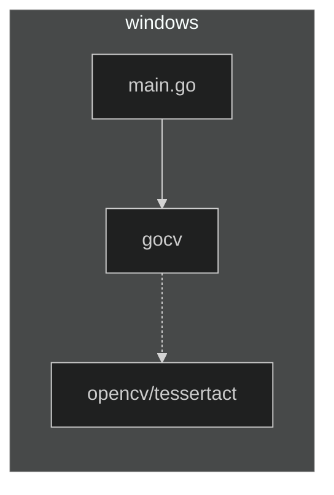
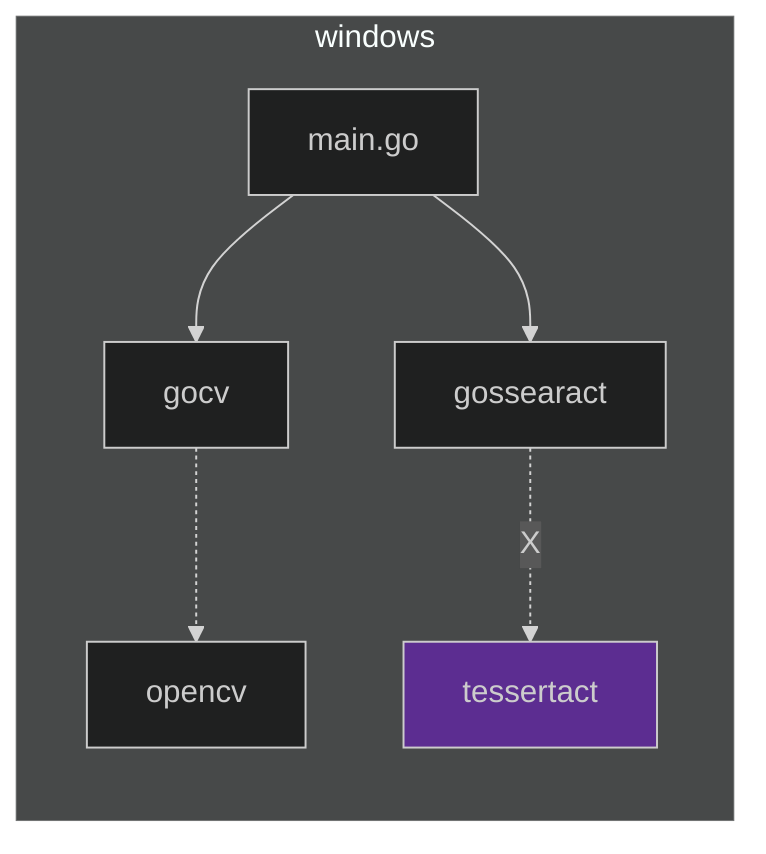
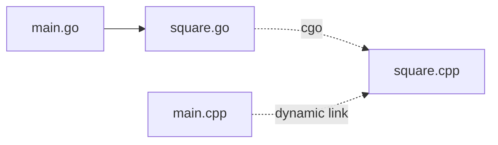
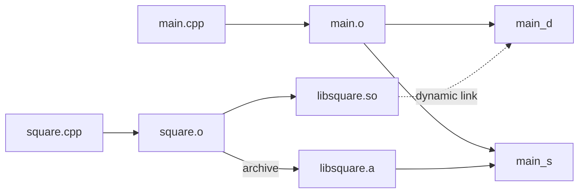

## この記事はなに

Windows上で golang から OpenCV の OCR を使おうとして派手にハマったので整理してみた。個人的なメモです。

# やりたいこと

## 経緯
Windows環境で、Webカメラの画像を解析して、特定文字列をみつけて通知したかった。  
利用先の環境をできるだけ汚したくないので、exe一つ置けばいいらしい golang を選択した。  
あとからわかったことだが、この判断が茨の道の始まりだった。

## 初期のデザイン

golang の func main() から opencv同梱の OCR API を叩いてテキストを取り出すことにした。
- golang から [opencv](https://opencv.org/) を使うには [gocv](https://gocv.io/) を使えばよさそう:  
- [opencv に入ってる tesseract という OCRライブラリ](https://docs.opencv.org/4.5.5/d7/ddc/classcv_1_1text_1_1OCRTesseract.html) でテキストを取れそう:  
  
- go build を実行することで生成される exe を利用先にコピーすることにしよう。



## やってみたら、課題が山積

やってみたところ、たくさんの課題があった。  
(用語説明してないので「なんのこっちゃ」でしょうけど、順番に説明します。まずは雰囲気だけ掴んでください)

1. go build で生成された exe をコピーするだけでは動かなかった。依存するdllが必要だった。
1. opencvの Prebuildバイナリは、msvc版だった。
1. gocv から opencv を利用するための仕組みである "cgo" が mingw だった。
    - gocvの導入手順でビルドしたopencvバイナリは、mingw版になった。
    - gocvの導入手順でビルドしたopencvバイナリは、tessaract が含まれていなかった。
1. go から tessaract を使える gossaract を見つけたが、tessaract は自分で調達する必要があった。
    - tessaract の Prebuildバイナリは、msvc版だった。
    - tessaract のビルド手順にそってビルドしたtessaractバイナリは、msvc版になった。



## 次に考えたデザイン

1. mingw版tessaractを作る案。  
   go から gocv の cgo 経由で mingw版opencvを使う。  
   go から gossaract の cgo 経由で mingw版tessaractを使う。  
1. cgoからmsvc版opencvを読みだす案。  
   go から gocv の cgo 経由で msvc版opencvを使う。  
   tessaract は opencv 同梱のものを使う。

----

## 問題を最小化して考える

シンプルに以下のソースで考える:



```go:main.go
package main

import ( "fmt" )

func main() { fmt.Println(gosquare(8)) }
```

```go:square.go
package main

import (
        //#cgo LDFLAGS: -lsquare -L.
        //#include "square.h"
        "C"
)

func gosquare(n C.int) C.int { return C.square(n) }
```

```c:square.h
#ifdef __cplusplus
extern "C"
#endif
const int square(const int n);
```

```cpp:square.cpp
#include "square.h"

#ifdef __cplusplus
extern "C"
#endif
const int square(const int n) {
        return n * n;
}
```

```cpp:main.cpp
#include "square.h"
#include <stdio.h>

int main(int argc, char* argv[]) {
        printf("%d\n", square(8));
}
```

## Ubuntu@WSLで so を作って利用する



```shell-session:bash
$ g++ -c square.cpp   # square.o を作る
$ ar rv libsquare.a  square.o   # 静的ライブラリに格納する
$ g++ --shared square.o  -o libsquare.so  # 共有オブジェクト化する
$ file libsquare.so
libsquare.so: ELF 64-bit LSB shared object, x86-64, version 1 (SYSV), dynamically linked, not stripped
$ nm libsquare.so | grep square  ## シンボルを見てみると、T すなわち実体を伴っている
00000000000010f9 T square
```
```shell-session:bash
$ g++ -c main.cpp
$ g++ -o main_d main.o -lsquare -L.  # main_dを作る。(main_dはsquareを動的に参照する)
$ nm main_d | grep square  # U すなわち実体ではなく参照しか持っていない
                 U square
$ objdump -p main_d | grep square
  NEEDED               libsquare.so
$ ./main_d  # 共有ライブラリを見つけられてない
./main_d: error while loading shared libraries: libsquare.so: cannot open shared object file: No such file or directory
$ LD_LIBRARY_PATH=. ./main_d  # 共有ライブラリを見つけられる
64
```
```shell-session:bash
$ go run main.go square.go  # golangでも 共有ライブラリを見つけられてない
/tmp/go-build727704632/b001/exe/main: error while loading shared libraries: libsquare.so: cannot open shared object file: No such file or directory
$ LD_LIBRARY_PATH=. go run main.go square.go  # 共有ライブラリを見つけられる
64
```

## Visual Studio Build Tools 2022 で dll を作って利用する

```powershell:powershell
# main.cpp -> main.obj
# square.cpp -> square.obj
PS C:\> cl /c main.cpp
PS C:\> cl /c square.cpp

# square.obj -> square.dll, square.lib
# "square" という名前を外に見せるように指定。
# /exportを指定することで .lib が同時に生成される。
PS C:\> link /dll /export:square square.obj

# main.obj + square.lib -> main.exe (ダイナミックリンク; square.dllを参照する)
PS C:\> link main.obj square.lib
PS C:\> dumpbin /dependents .\main.exe
  Image has the following dependencies:
    square.dll
    KERNEL32.dll

# main.obj + square.obj -> main.exe (スタティックリンク)
PS C:\> link main.obj square.obj
PS C:\> dumpbin /dependents .\main.exe
  Image has the following dependencies:
    KERNEL32.dll
```

## mingw64 で dll を作って利用する

あるいはTDM-GCC

```bat:
:: main.cpp -> main.o
:: square.cpp -> square.o
g++ -c main.cpp
g++ -c square.cpp

:: square.o -> square.dll
:: -shared をつけると dll 形式で作成される。 --shared ではない。2時間溶かした
:: g++ コマンドでリンクすると stdc++もリンクされるのでサイズが大きくなる
ld square.o -shared -o square.dll
```

## LLVM/CLANG で dll を作って利用する

llvm.org あるいは Visual Studio Installer から


# Tessaract を組み立てる

https://github.com/UB-Mannheim/tesseract/wiki
Additional Script Data - Japanese Script
Additional Language Data - Japanese
C:\Program Files\Tesseract-OCR

ヘッダとライブラリはソースから
git clone https://github.com/tesseract-ocr/tesseract
cd src